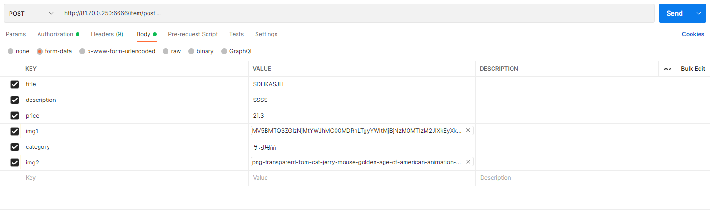
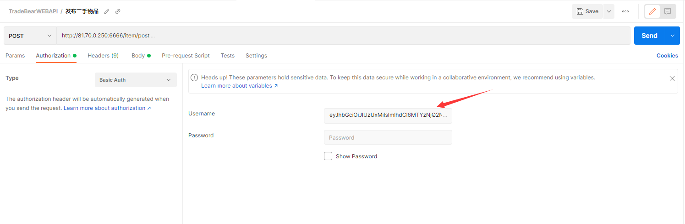
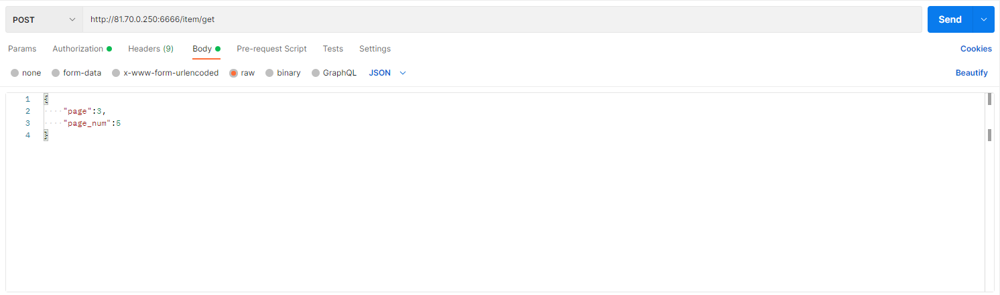

# Trade_Bear_Backend
### 部署项目
```
source /home/ubuntu/develop/bin/activate # 激活环境
cd /home/ubuntu/Trade_Bear_Backend/      # 进入项目的文件夹
gunicorn -b 0.0.0.0:6666 manage:app      
```
### Address
```
http://81.70.0.250:6666         # API请求地址
http://81.70.0.250:8080/static/ # 图片访问地址
```
### 用户注册

### 用户登录

### 发布商品

注意：此处要有Token认证如下

### 获取商品

注意：Linux已搭载Tomcat，可以直接通过返回的图片URL来访问